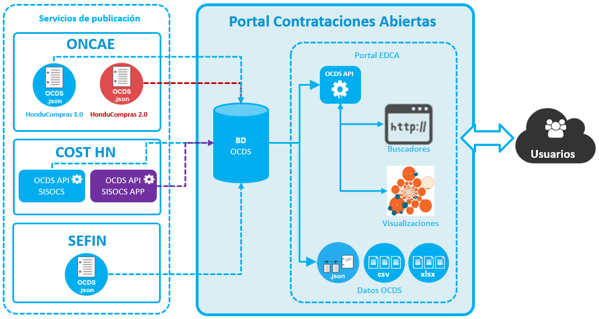

# Portal de Contrataciones Abiertas (Backend - Frontend)
Una herramienta web para buscar, explorar y visualizar procesos de contrataciones abiertas utilizando el estándar de datos OCDS.

## Arquitectura


## Requerimientos
* KingFisher (PostgreSQL)
* import_data (Elasticsearch)
* Python 3
* Django 2.14

## Instalación paso a paso
**Paso 1-** Instalar base de datos Kingfisher, ver en: [https://github.com/portaledcahn/edcahn_kingfisher](https://github.com/portaledcahn/edcahn_kingfisher)

**Paso 2-** Instalar el importador de datos de KingFisher a Elasticsearch, ver en: [https://github.com/portaledcahn/import_data](https://github.com/portaledcahn/import_data)

**Paso 3-** Instalar Python 3.7
```
sudo yum install gcc openssl-devel bzip2-devel wget libffi-devel xz-devel sqlite-devel postgresql-devel
cd /usr/src
sudo wget https://www.python.org/ftp/python/3.7.3/Python-3.7.3.tgz
sudo tar xzf Python-3.7.3.tgz
cd Python-3.7.3
./configure
./configure --enable-optimizations
make altinstall
vi /root/.bashrc
alias python3='/usr/local/bin/python3.7'
alias pip3='/usr/local/bin/pip3.7'
:wq
```

**Paso 4–** Clonar el repo:
```
mkdir /home/portaledca
cd /home/portaledca/
git clone https://github.com/portaledcahn/edcahn_backend.git
```

**Paso 5–** Instalar virtualenv
```
pip3 install virtualenv
cd /home/portaledca
python3 -m venv portaledca_env
source portaledca_env/bin/activate
```

**Paso 6-** Instalar requerimientos:
```
cd /home/portaledca/edcahn_backend
pip install -r requirements.txt
```

**Paso 7-** Crear archivo de configuración
```
cp /home/portaledca/edcahn_backend/portaledcahn/settings_template.py /home/portaledca/edcahn_backend/portaledcahn/settings.py
```

**Paso 8-** Editar archivo de configuración, en esta sección es necesario actualizar los parámetros de conexión a las bases de datos kingfisher y Elasticsearch. 
```
vi settings.py

ALLOWED_HOSTS = [
    '127.0.0.1',
]

# Actualizando parametros de conexión a kingfisher
DATABASES = {
    'bdkingfisher': {
        'ENGINE': 'django.db.backends.postgresql_psycopg2',
        'NAME': 'ocdskingfisher',
        'USER': 'username',
        'PASSWORD': '******',
        'HOST': '127.0.0.1',
        'PORT': '5432',
    },
    'portaledcahn_admin': {
        'ENGINE': 'django.db.backends.postgresql_psycopg2',
        'NAME': 'portaledcahn_admin',
        'USER': 'username',
        'PASSWORD': '******',        
        'HOST': '127.0.0.1',
        'PORT': '5432',
    }
}

# Actualizar parámetros de conexión a Elasticsearch
ELASTICSEARCH_DSL_HOST = '127.0.0.1:9200/'
ELASTICSEARCH_USER = 'username'
ELASTICSEARCH_PASS = '******'

:wq
```

**Paso 9-** Iniciar el servidor de Django
```
python manage.py collectstatic
python manage.py runserver 0.0.0.0:8000
```

## Licencia
Esta obra está bajo una licencia de Creative Commons Reconocimiento 4.0 Internacional.


